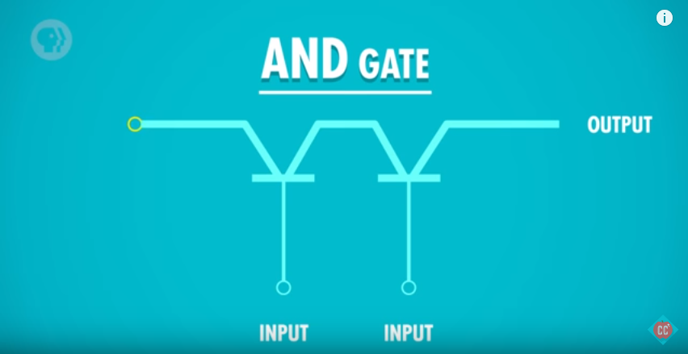
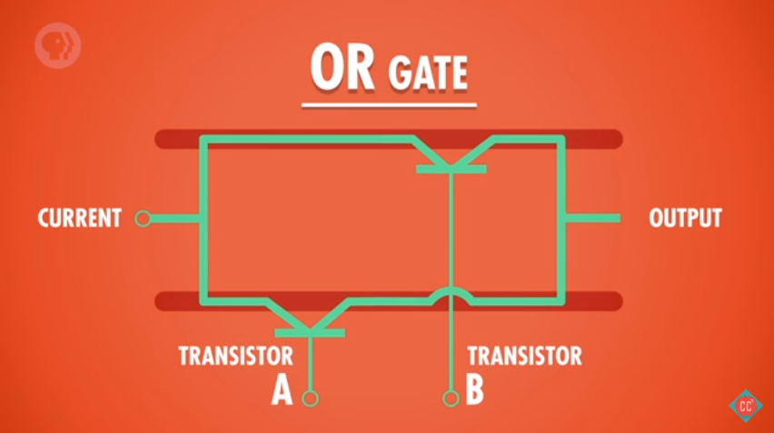
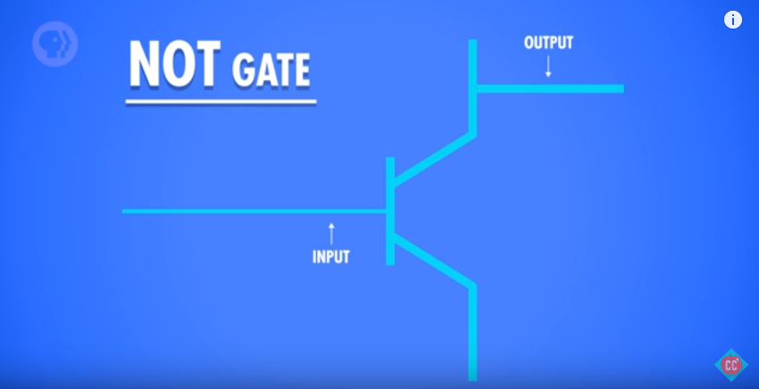
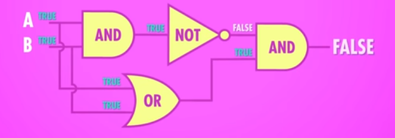

=========================
Philbin Silicon Simulator
=========================

*"A virtual computer built from conceptual hardware created using software running on a real computer"*

A work in progress...  

After watching `Crash Course Computer Science`_ I decided I wanted to make my own computer, after realising it would require a lot of transistors that I didn't have, I thought "hey, if I could code one transistor, I could use it many times".  

I have no idea what I was thinking!

The heart of PhilbinSS is a Transistor simulator and the components required to connect transistors together. These components are the only place where logic is coded, all other functions are created by connecting transistors together. 

Using these simple components you can create all the key elements of a computer - this is done through levels of abstraction:

* Transistor 
  
  * Not, And, Or 
  
    * Xor  
  
      * Half Adder
  
        * Full Adder
  
          * 8 bit Ripple Carry Adder
  
            * and so on...  

The current highest level of abstraction is ``ALU`` or ``16 byte memory storage matrix`` (depending on your point of view!).

The project is named after the host of the show `Carrie Anne Philbin`_.

Components
==========

Using 3 simple components ``Transistor``, ``Split`` and ``Join`` you can create a computer.

Transistor
----------

A transistor has 3 connections (collector, base, emitter), when the collector and base are supplied with power, power is sent to the emitter (output). The transistor has a 2nd output connected to the collector, which will be powered when the collector is powered but the base is not.

You can create a transistor and connect it up using::

    from components import Transistor, Power
    
    # create the transistor and a power switch
    t = Transistor()
    p = Power()

    # connect the power to the transistor's base 
    p.connect(t.base)
    
    # the emitter will be False because the power to the base is off 
    print(t.emitter)
    # the output at the collector will be True
    print(t.collector_output)
    
    # turn the power on to the base
    p.on()

    # the emitter will be True
    print(t.emitter)
    # the output at the collector will be False
    print(t.collector_output)
    
By default, power is supplied to the transistor's collector, you can create an unpowered transistor using:: 

    t = Transistor(connect_to_power = False)

Split
-----

If you need to split an input to multiple nodes you can use a Split::

    from components import Transistor, Power, Split
    
    # create transistors and a power
    t1 = Transistor()
    t2 = Transistor()
    p = Power()

    # create a split to both transistor bases 
    input_split = Split(t1.base, t2.base)

    # connect up the power to split (and both transistor bases)
    p.connect(input_split.input)

    # both transistors are off
    print(t1.emitter)
    print(t2.emitter)

    # turn the power on
    p.on()

    # both transistors are on
    print(t1.emitter)
    print(t2.emitter)

Join
----

If you need to join many inputs to one output you can use a Join::

    from components import Transistor, Power, Join

    # create 2 switches and a transistor
    p1 = Power()
    p2 = Power()
    t = Transistor()

    # join the 2 outputs
    output_join = Join(p1, p2)

    # connect the output of te join to the transistor
    output_join.output.connect(t.base)

    # both powers are off, transistor is off
    p1.off()
    p2.off()
    print(t.emitter)

    # either power will turn on the emitter because they are joined
    p1.on()
    p2.off()
    print(t.emitter)

    p1.off()
    p2.on()
    print(t.emitter)

Logic gates
===========

The 4 logic gates, ``And``, ``Or``, ``Not`` and ``Xor`` are the base logic gates needed.

And
---

An And gate is created using 2 transistors, the base connections are the inputs, the output from transistor 1's emitter is connected to transistor 2's collector and the result is the output of transistor 2's emitter:

|andlogicgate|

::

    from components import Transistor, Power

    # create the transistors
    t1 = Transistor()
    t2 = Transistor(connect_to_power = False)

    # create the power switches 
    input_a = Power()
    input_b = Power()

    # connect the inputs 
    input_a.connect(t1.base)
    input_b.connect(t2.base)

    # connect t1's emitter to t2's collector
    t1.emitter.connect(t2.collector)

    # create a variable for the output
    output = t2.emitter

    # both inputs are off, the output is False
    input_a.off()
    input_b.off()
    print(output)

    # one input is on, the output is still False
    input_a.on()
    input_b.off()
    print(output)

    # both inputs are on, the output is True
    input_a.on()
    input_b.on()
    print(output)

Or
---

An Or gate is created by connecting 2 transistors in parallel, the base connections are the inputs, the output is the obtained by joining the emitters:

|orlogicgate|

::

    from components import Transistor, Power, Join

    # create the transistors
    t1 = Transistor()
    t2 = Transistor()

    # create the power switches 
    input_a = Power()
    input_b = Power()

    # connect the inputs 
    input_a.connect(t1.base)
    input_b.connect(t2.base)

    # the output is the join of the 2 emitters.
    output = Join(t1.emitter, t2.emitter).output

    # both inputs are off, the output is False
    input_a.off()
    input_b.off()
    print(output)

    # input a is on, input b is off, the output is True
    input_a.on()
    input_b.off()
    print(output)

    # input a is off, input b is on, the output is True
    input_a.off()
    input_b.on()
    print(output)

    # both inputs are on, the output is True
    input_a.on()
    input_b.on()
    print(output)

Not 
---

A not gate is made using a single transistor, the input is connected to the base, the output is connected to the collector:

|notlogicgate|

::

    from components import Transistor, Power

    # create the transistor
    t = Transistor()

    # create the power switch
    theinput = Power()

    # connect the input
    theinput.connect(t.base)

    # create a varibale for the output
    output = t.collector_output

    # input is off, the output is True
    theinput.off()
    print(output)

    # input is on, the output is False
    theinput.on()
    print(output)

Xor
---

An Xor gate is create by connecting And, Or and Not gates together.

|xorlogicgate|

::

    from components import Power, Split
    from logicgates import And, Or, Not
    
    # create swtiches
    p1 = Power()
    p2 = Power()

    # create gates
    a1 = And()
    o = Or()
    n = Not()
    a2 = And()

    # split input a and b to go to the and1 and or gate 
    input_a = Split(a1.input_a, o.input_a).input
    input_b = Split(a1.input_b, o.input_b).input

    # connect the switches
    p1.connect(input_a)
    p2.connect(input_b)

    # output of and2 to not
    a1.output.connect(n.input)
    
    # output of not to and2
    n.output.connect(a2.input_a)
    
    # output of or to and2
    o.output.connect(a2.input_b)
    
    # output is the result of and2
    output = a2.output

    # both inputs are off, the output is off
    p1.off()
    p2.off()
    print(output)

    # either input is on, the output is on
    p1.off()
    p2.on()
    print(output)

    p1.on()
    p2.off()
    print(output)

    # both inputs are on, the output is off
    p1.on()
    p2.on()
    print(output)

Links
==========

The following sites have been really useful in providing background information, tutorials and images.

`Crash Course Computer Science`_
`www.electronics-tutorials.ws`_
`electronics.stackexchange.com`_
`www.allaboutcircuits.com`_

`Martin O'Hanlon`_ `stuffaboutco.de`_ `@martinohanlon`_

.. _Martin O'Hanlon: https://github.com/martinohanlon
.. _stuffaboutco.de: http://stuffaboutco.de
.. _@martinohanlon: https://twitter.com/martinohanlon
.. _Carrie Anne Philbin: https://twitter.com/MissPhilbin 

.. _Crash Course Computer Science: https://www.youtube.com/watch?v=tpIctyqH29Q&list=PL8dPuuaLjXtNlUrzyH5r6jN9ulIgZBpdo
.. _www.electronics-tutorials.ws: http://www.electronics-tutorials.ws
.. _electronics.stackexchange.com: https://electronics.stackexchange.com
.. _www.allaboutcircuits.com: https://www.allaboutcircuits.com/

